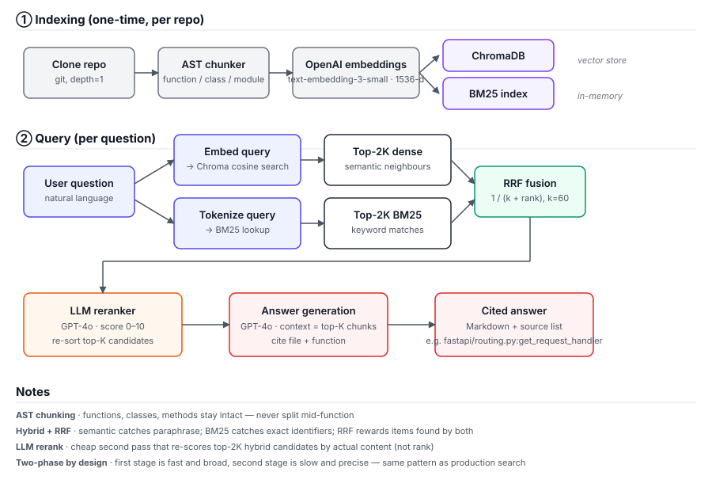

# RAG Repo Copilot

> Ask any GitHub repo a natural-language question and get a cited code answer. Hybrid retrieval (semantic + BM25 + RRF) feeds an LLM reranker before answer generation.



## What it does

Point it at a repo URL → it clones, chunks the source by AST (functions/classes, never mid-function), embeds with OpenAI, and indexes both into ChromaDB and an in-memory BM25. At query time it runs **dense + BM25 in parallel**, fuses with **Reciprocal Rank Fusion**, then **reranks the top candidates with GPT-4o** before sending the survivors to the answer model. Answers come back with file path + function name citations so you can jump straight to the source.

The retrieval pipeline is the interesting part — see the **Evaluation** section below for the ablation that quantifies what each stage contributes.

## Quick start

```bash
git clone https://github.com/valerie1122/rag-repo-copilot.git
cd rag-repo-copilot
python -m venv venv && source venv/bin/activate
pip install -r requirements.txt
cp .env.example .env   # then add your OPENAI_API_KEY
uvicorn src.api.main:app --reload   # http://localhost:8000/docs
```

Or `docker compose -f docker-compose.local.yml up --build` for a containerised run.

### Use it

```bash
# 1) Ingest a repo
curl -X POST localhost:8000/repos -H 'content-type: application/json' \
  -d '{"repo_url": "https://github.com/tiangolo/fastapi"}'

# 2) Ask
curl -X POST localhost:8000/ask -H 'content-type: application/json' \
  -d '{"question": "How does dependency injection work?"}'
```

## Design decisions

### Why AST chunking, not line-splitting?

Splitting Python by N-line windows cuts functions in half. The model then sees a fragment with no signature, no docstring, and ambiguous indentation. AST chunking keeps every function, method, and class as one chunk — each retrieved chunk is a complete, executable unit with its own context. The cost is a slightly more complex chunker (handle nested classes, async fns, module-level code as a residual chunk); the win is that retrieval surfaces things the model can actually reason about.

### Why hybrid retrieval (semantic + BM25)?

Semantic search (cosine over embeddings) generalizes — it can match `"check if user is logged in"` to a function called `verify_session_token`. But it gets fooled by paraphrase: ask for `"jsonable_encoder"` by name and a pure-semantic search may rank it below five vaguely similar serializer helpers. BM25 is the inverse: brittle on paraphrase, lethal on exact identifiers. Code questions are bimodal — sometimes you ask "how does this work" (semantic), sometimes you ask "where is `OAuth2PasswordBearer`" (lexical). One retriever can't win both. The ablation table below shows how much each contributes.

### Why RRF fusion (and not weighted sum)?

Cosine distance and BM25 scores live in different scales (and different distributions per query). Weighted sums require per-query normalization that's never quite right. **Reciprocal Rank Fusion** sidesteps the problem entirely: it ignores raw scores and only looks at *positions* in each ranked list, with `score = 1/(k + rank)`. A chunk that shows up in both lists gets both contributions and floats to the top — no tuning needed.

### Why an LLM reranker?

After RRF we have ~10 plausible candidates, but their relative order still reflects the retriever's biases (RRF doesn't read the code). A reranker pass shows GPT-4o the actual chunk content alongside the question and asks for a 0–10 score. It's slower and costs an extra LLM call per query, but the cost is bounded (one fixed-size call) and the precision lift on the top-K is the largest single contributor in the ablation. Pattern: retrieve cheaply and broadly → rerank expensively and precisely.

## Evaluation

### Test set

**Why FastAPI as the test repo.** Medium size makes labeling tractable; Python with consistent naming conventions provides a fair test for both keyword and semantic retrieval; it matches the project's own tech stack, making relevance judgments easier; widely-known APIs reduce labeling bias.

40 hand-labeled queries against the FastAPI source (`tiangolo/fastapi`, ~46 files indexed → 395 AST chunks). Each query is annotated with 1–3 relevant chunk IDs of the form `{file_path}::{name}`. Queries are split 20/20 between **explicit** (mentions a specific identifier — favours BM25) and **fuzzy** (conceptual question, no exact-match terms — favours semantic). The full set lives in [`eval/queries_fastapi.json`](eval/queries_fastapi.json).

### Metrics

- **Hit Rate@5** — fraction of queries where any relevant chunk appears in the top-5 results.
- **MRR (Mean Reciprocal Rank)** — `1/rank` of the first relevant result, averaged over all queries (0 if not in top-5).

### Ablation design: why 3 modes

The three modes (A: dense-only → B: + BM25/RRF → C: + LLM rerank) are designed to **isolate the contribution of each component**. Mode A establishes a baseline; B measures whether keyword-based fusion adds signal on top of semantic retrieval; C measures the additional lift from neural reranking. This decomposition matters because RAG papers often report "hybrid + rerank" as a single improvement, hiding which component does the real work — and as the table below shows, the answer can be surprising.

### Results

<!-- EVAL_TABLE_START -->
<!-- Auto-generated by scripts/render_readme.py — do not edit by hand -->
_Test set: 40 hand-labeled queries against `tiangolo/fastapi` (395 chunks). Embeddings: `text-embedding-3-small`._

| System | Hit Rate@5 | MRR | Δ HR | Δ MRR |
|---|---:|---:|---:|---:|
| A. Dense only (semantic baseline) | **0.925** | **0.794** | — | — |
| B. + BM25 + RRF | **0.900** | **0.738** | -0.025 | -0.055 |
| C. + LLM rerank (full system) | **0.975** | **0.893** | +0.050 | +0.099 |

**Breakdown by query kind** (HR@5 / MRR):

| System | Explicit-name queries | Fuzzy/conceptual queries |
|---|---|---|
| A. Dense only (semantic baseline) | 0.900 / 0.850 | 0.950 / 0.738 |
| B. + BM25 + RRF | 0.900 / 0.779 | 0.900 / 0.698 |
| C. + LLM rerank (full system) | 1.000 / 0.900 | 0.950 / 0.885 |
<!-- EVAL_TABLE_END -->

Reproduce with:

```bash
git clone --depth 1 https://github.com/tiangolo/fastapi.git repos/fastapi
python -m scripts.evaluate \
  --repo-path repos/fastapi/fastapi \
  --queries eval/queries_fastapi.json
python -m scripts.render_readme   # rewrites the table above
```

The eval is self-contained: it caches embeddings to `eval/cache_fastapi.npz` so re-runs are ~30s after the first ~3-5 minute indexing pass. Scoring uses exact cosine similarity in numpy rather than Chroma's HNSW — for a 395-chunk corpus the two are equivalent (HNSW only approximates above ~10K vectors), and the standalone eval is reproducible from scratch without any persistent vector-store state.

## Tech stack

FastAPI · Streamlit (browser UI) · ChromaDB (vector store) · BM25Okapi (rank-bm25) · OpenAI `text-embedding-3-small` (1536-d) · GPT-4o (rerank + answer) · Python AST module · Docker · Render (deploy).

## Project structure

```
src/
  api/         FastAPI endpoints (POST /repos, POST /ask)
  ingestion/   Git clone + AST chunker
  embedding/   OpenAI embeddings + Chroma store
  retrieval/   hybrid (BM25+RRF), reranker, qa_chain
scripts/
  evaluate.py        3-mode ablation eval — produces eval/results.json
  render_readme.py   Renders results.json into the README table
eval/
  queries_fastapi.json   40 labeled queries
  results.json           Eval output (committed so README ↔ data stays consistent)
  smoke_test.py          Mock-embedder sanity check for the metrics math
docs/
  architecture.svg       This README's hero diagram
tests/                   Unit tests for chunker, embedder, hybrid, reranker
```

## Limitations & honest caveats

- **Single language.** Chunker only handles Python (uses `ast`). Other languages would need tree-sitter or per-language parsers.
- **In-memory BM25.** Rebuilt at process start from the chunk store. Fine for one repo per worker; a multi-tenant deployment would need a persistent BM25 (e.g. Tantivy).
- **One-shot retrieval.** No conversational memory, no query rewriting, no follow-up resolution. A "did you mean X?" loop would help fuzzy queries that miss.
- **Eval set is mine to label.** 40 queries on one repo is a real signal, not a benchmark. Generalising the numbers requires more repos and ideally inter-annotator agreement.
- **Reranker cost.** ~$0.001 per query at GPT-4o pricing (~10 chunks × 500 tokens). Cheap individually, but scales linearly with QPS.

## License

MIT.
