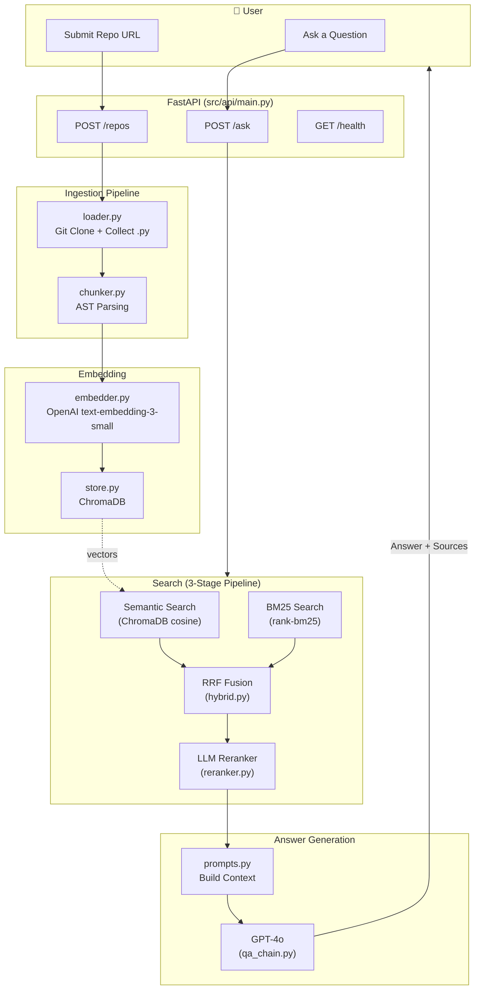
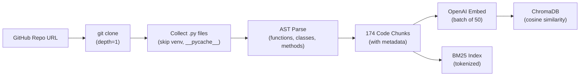
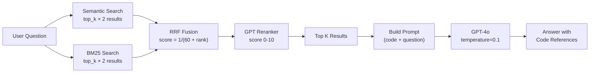

# Architecture

## System Overview

## Data Flow: Ingestion

## Data Flow: Query

## Component Details

| Component | File | Purpose | Key Tech |
|-----------|------|---------|----------|
| API Gateway | `src/api/main.py` | HTTP endpoints, request validation | FastAPI, Pydantic |
| Repo Loader | `src/ingestion/loader.py` | Clone repos, collect Python files | GitPython |
| Code Chunker | `src/ingestion/chunker.py` | Split code into semantic units | Python AST |
| Embedder | `src/embedding/embedder.py` | Convert text → vectors | OpenAI API |
| Vector Store | `src/embedding/store.py` | Store & search vectors | ChromaDB |
| Hybrid Search | `src/retrieval/hybrid.py` | BM25 + semantic fusion | rank-bm25, RRF |
| Reranker | `src/retrieval/reranker.py` | LLM-based re-scoring | GPT-4o |
| QA Chain | `src/retrieval/qa_chain.py` | Pipeline orchestration | OpenAI API |
| Prompts | `src/retrieval/prompts.py` | Prompt engineering | Template strings |
| Config | `src/config.py` | Centralized settings | python-dotenv |

## Design Decisions

### Why AST chunking instead of fixed-size chunks?

Fixed-size chunks (e.g., 500 tokens) often split functions in half, losing context. AST-based chunking ensures each chunk is a complete function, class, or method — preserving the semantic boundary of the code.

### Why hybrid search instead of just vector search?

Vector search understands meaning ("connect database" → finds "init_db_connection") but misses exact matches. BM25 excels at exact matching ("test_digest_auth" → finds that exact function). Combining both with RRF gives the best of both worlds.

### Why LLM reranking?

RRF only considers rank positions, not actual content. The LLM reranker reads both the question and each code snippet, then scores relevance on a 0-10 scale. This catches cases where a high-ranked result is actually irrelevant.

### Why ChromaDB?

Simple, runs locally, no server needed. Perfect for development and portfolio projects. For production, you'd switch to Pinecone or Weaviate for cloud hosting and scalability.
